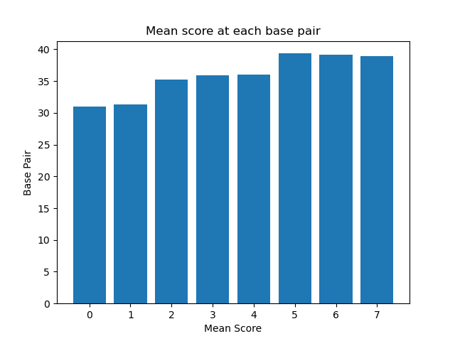
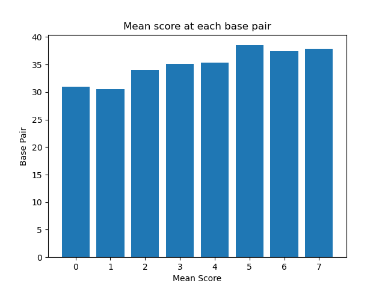
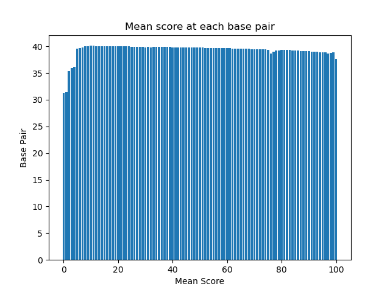
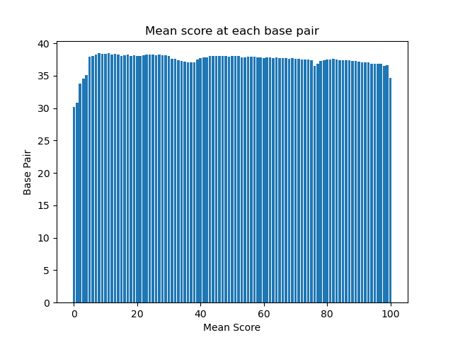

# Assignment the First

## Part 1
1. Be sure to upload your Python script. Provide a link to it here:

| File name | label | Read length | Phred encoding |
|---|---|---|---|
| 1294_S1_L008_R1_001.fastq.gz |read 1 |101  |33 |
| 1294_S1_L008_R2_001.fastq.gz |index 1  |8 |33  |
| 1294_S1_L008_R3_001.fastq.gz |index 2  |8  |33  |
| 1294_S1_L008_R4_001.fastq.gz |read 2  |101  |33  |

2. Per-base NT distribution
    1. Use markdown to insert your 4 histograms here.
    
    
    
    
    2. A good cutoff score for the biological read pairs would be 30. I got this from looking at the distribution plot and that showed that 35 is a good cutoff point that doesnt cause the loss of too much data and also ensures that good quality reads are left.
    For the index reads I think a cutoff score of 32 would be appropriate. It would remove lower quality reads while leaving us with a good amount of quality reads.

    3. `zcat /projects/bgmp/shared/2017_sequencing/1294_S1_L008_R2_001.fastq.gz | grep '@' -A 1 | grep -v '@' | grep -v '^--'| grep 'N' -c
               3976613`
        
        `zcat /projects/bgmp/shared/2017_sequencing/1294_S1_L008_R3_001.fastq.gz | grep '@' -A 1 | grep -v '@' | grep -v '^--'| grep 'N' -c
               3328051`
        
        `CHALLENGE - zcat /projects/bgmp/shared/2017_sequencing/1294_S1_L008_R[2-3]_001.fastq.gz | grep '@' -A 1 | grep -v '@' | grep -v '^--'| grep 'N' -c
               7304664`
    
## Part 2
1. Define the problem
2. Describe output
3. Upload your [4 input FASTQ files](../TEST-input_FASTQ) and your [>=6 expected output FASTQ files](../TEST-output_FASTQ).
4. Pseudocode
5. High level functions. For each function, be sure to include:
    1. Description/doc string
    2. Function headers (name and parameters)
    3. Test examples for individual functions
    4. Return statement
